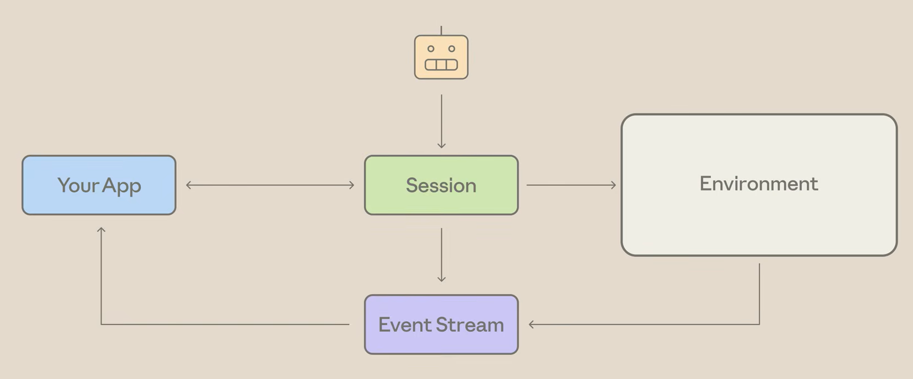
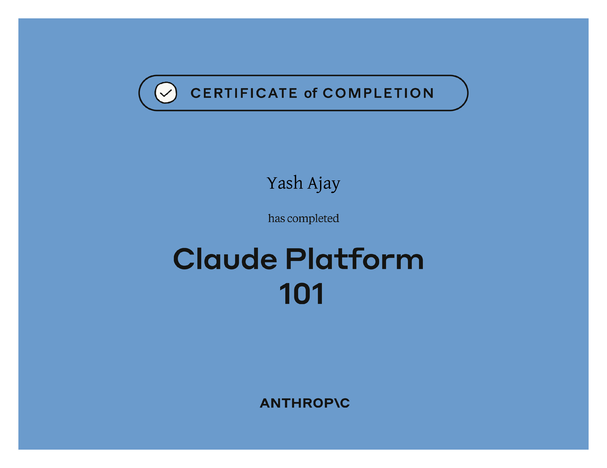

# Claude Platform 101

## Course Notes

> URL: [Claude-Platform-101](https://anthropic.skilljar.com/claude-platform-101)

### What is Claude Platform

- Anthropic's infrastructure for **building with Claude programmatically**.
- **Pieces of this Infrastructure:** REST API, SDKs (for different programming languages), CLI, Console (for API Keys, Usage Monitoring, etc.)
- **Layers of the Platform**
  - **Primitives:** API building blocks tuned to Claude (Messages API, Tool Use, Web Search, etc.).
  - **Infrastructure:** Build and Scale agentic systems past a prototype.
  - **Controls:** Tools for running the systems in production (Dashboards and Evals).

### Anatomy of a Request

- **Model:** Which Claude model handles the request.
- **Max Token Limit:** A cap on how long the response can be.
- **List of Messages:** JSON objects with either `user` or `assistant` roles.

### Model Tiers

- **Haiku:** Fastest and Cheapest, but Least Intelligent. Use for small, less complex tasks.
- **Sonnet:** Middle Tier. Between Haiku and Opus. Use for tasks that Haiku can't handle but are not complex enough to justify the cost of Opus.
- **Opus:** Second to Fable (newest tier). Very costly and slow but handles complex tasks with ease. Use when the tasks need deep research or multi-step processing.
- **Fable:** Smartest model tier yet, but extremely costly and slow. This model is **not** for every day use, but should be used when none of the other models can do it.

### The Agent Loop

- **Autonomous version** of Claude, running both sides of the messaging without human intervention.
- **Example Flow:**
  - Send a message to Claude with tools available.
  - Claude either responds with a final answer or a request to use a tool.
  - Code executes the tool.
  - Code sends the result back to Claude.
  - Repeat until stop reason is as mentioned in the code (e.g. end_turn).

### Tools

- A **function defined and exposed** to Claude.
- **Tool Definition:** Name, Description, Input Schema
- **Tool Runner**
  - Ships in the Claude SDK for Python, Ruby and TypeScript.
  - The runner takes actual functions, reads the types and docs to build the schema.
  - It also handles the entire tool use / tool result loop internally.

### Extended Thinking

- Claude can work through a problem before responding.
- Claude reasons step-by-step before producing a final response.
- **Thinking Levels:** low, medium, high, xhigh, max
- **When to Use:** Math/Multi-Step Logic, Code Debugging, Regulatory Analysis, Anything that involves trade-offs or comparing options.

### Built-In Tools

- **Server Tools:** Web Search, Code Execution, Web Fetch (Available to the models via Cloud)
- **Client Tools:** Memory, Bash (Shipped with Anthropic SDK)

### Skills

- **Skills vs Tools**

| Tools              | Skills               |
| ------------------ | -------------------- |
| Connect to Data    | Teach a Procedure    |
| Take Actions       | Just Instructions    |
| Run Code           | No Code Runs         |
| What Claude Can Do | How you Want it Done |

- **Uploading a Skill:** `client.skills.create(display_title: str, files: File)`

### MCP

- **Tools** you need to maintain yourself, **Skills** are just procedures that Claude will follow, **MCP** allows 3rd party integration without the headache of maintenance.
- **How to Connect:** `client.messages.create(mcp_servers: List<Json>, ...)`

### Managed Agents

- **Patterns for Managing Context:** Just-in-Time Context, Compaction, Caching, Memory
- Wire them up by hand, or use **Claude managed agents**, which **ship with caching and compaction on by default**.
- **Building Blocks of Managed Agents:** Agents, Sessions, Environments, Tools, MCP, Memory, Outcomes, Multi-Agent Coordination.

> Use Claude Code to write the codes for faster shipping!

## Certificate of Completion

