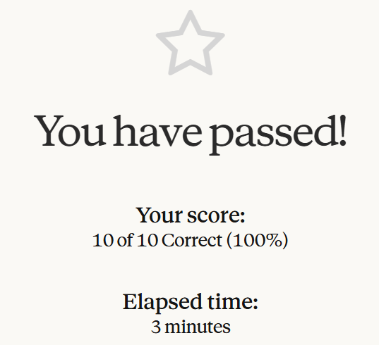
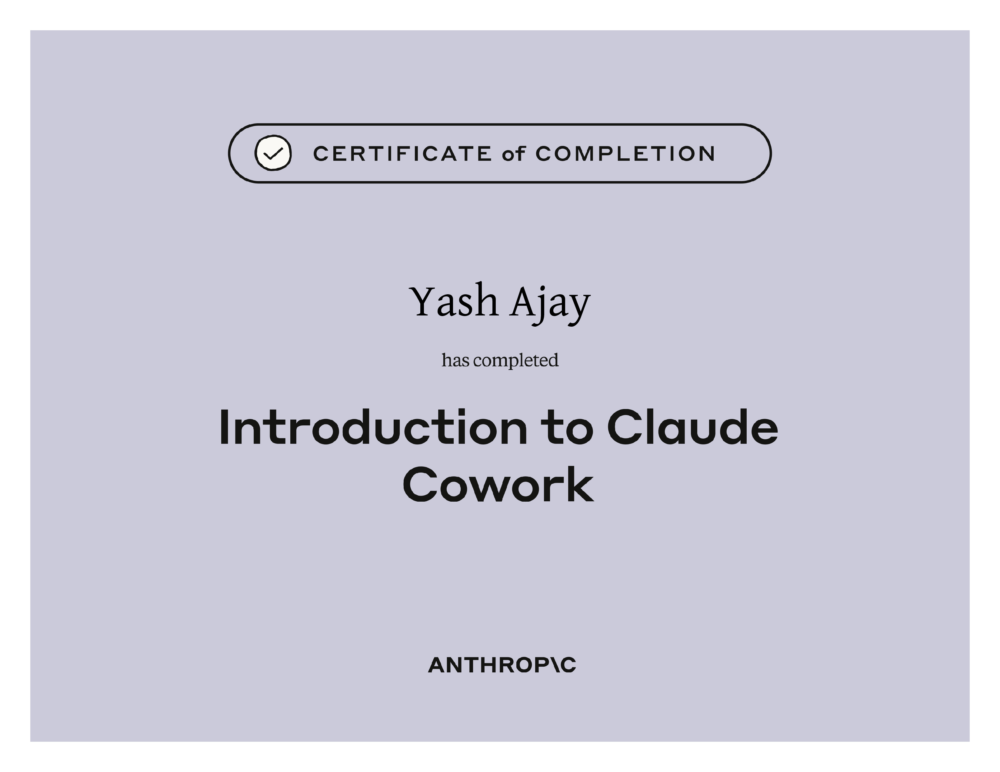

# Introduction to Claude Cowork

## Course Notes

> URL: [Introduction-to-Claude-Cowork](https://anthropic.skilljar.com/introduction-to-claude-cowork)

### What is Cowork?

- Cowork is a mode in Claude's Desktop App where Claude works on the tasks with you.
- It can take folders as context, generate documents and save them directly in the folder.
- **Chat** for thinking, **Cowork** for delegating, **Code** for software.

### Work that is **Right** for Cowork

- Multi-Step Task
- File-Based Task
- Multi-Tool Task

### Ways Cowork Learns about the User

- **Global Instructions:** Who the user is and how they work.
- **Projects:** The context of one stream of work.
- **Skills:** How a specific process should be done.
- **Plugins:** The expertise of the user's role or field.

### Ways to Start a Project

- From Scratch
- From Existing Folder (local)
- From a Chat Project

### Plugins

- A plugin is a **packaged set of skills** built around a job.
- Plugins teach Claude a **team's way of working**.
- Anthropic publishes **plugins for common roles**.
- **Types of Plugins**
  - **Shape 1:** An end-to-end process bundled together.
  - **Shape 2:** A team's most used skills bundled together.

### Claude in Chrome

- A **bridge for tools** that don't have a connector.
- Claude in Chrome and Cowork **work together**.
- **Permission modelling** keeps the user in control of the actions.
- **What this unlocks for the user:** Team's Tableau Dashboard, Vendor Portals/Customer Systems, Web Apps behind a Login, Web Search that ends in a Deliverable.

### Claude in M365

- **Available Integrations:** Outlook, Word, PowerPoint, Excel
- Cowork and Claude in M365 are **different tools for different moment**.

### Best Safety Practices

- **Set up so mistakes can't reach what matters**
  - Use a dedicated folder
  - Back up anything irreplaceable before starting
  - Test new workflows on copies/sample data first
- **Write prompts that leave no room for the wrong action**
  - Be specific about destructive verbs
  - Name the bounds in the prompt
  - Use scheduled tasks for drafts initially
- **In the moment: the three checks that catch the rest**
  - Read the plan once it has been made
  - Watch for unexpected patterns
  - Approve confirmation prompts deliberately

### When Coworks isn't the Right Tool

- Regulated workflows that need an audit trail
- Anything you wouldn't trust a smart, quick colleague to do unsupervised
- Highly sensitive personal data

### Validating Skills for Plugins

- **Eval System: Working**
  - When a new skill is created using Claude's skill-creator, it will give you a couple of examples on how the new skill makes a difference in the responses.
  - The responses will be in pairs of two: Using Skill and Without Using Skill, verify the responses and provide feedback accordingly.
- **Iterate on the Skill**
  - Your feedback is used as a fix to elevate the skill.
  - Update one thing at a time.

### Collaborating with the Team

- Scaling Workflows across a Team
- Distributing a plugin in your organization

## Certificate of Completion

