# Building with Claude API

## Course Notes

> URL: [Building-with-Claude-API](https://anthropic.skilljar.com/claude-with-the-anthropic-api)
>
> This course is more practical than theoretical, I recommend watching the course.

### 5-Step Process of Building a Chatbot

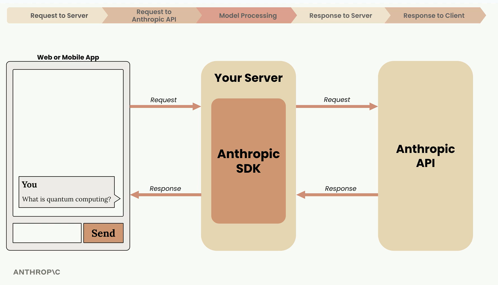

### Accessing Claude with API

#### Understanding `client.messages.create()` Function

- **Request Anatomy (mandatory fields):** model: str, max_tokens: number, messages: list[dict]
- The API does not store the conversation history, hence the user of the API needs to take care of that and pass the history via the "messages" attribute.
- User's message should always be with role "user", whereas AI's response should always be with the role "assistant".
- To customize the response format, specify a **system prompt** using the `system` attribute.
- Add `temperature` attribute to control the randomness. Accepted range is **0.0 - 1.0**.
- **Message Prefilling:**

#### Quiz 1

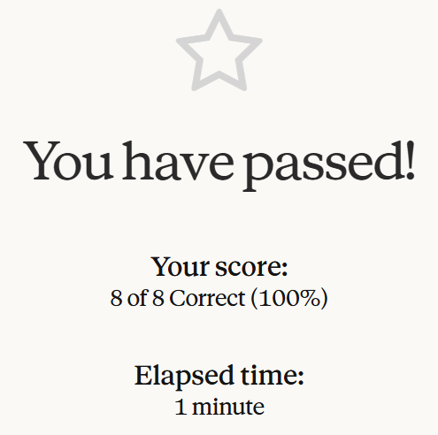

### Prompt Evaluation

#### Workflow

- Draft a Prompt
- Create an Eval Dataset (Either create by hand or use Haiku as this is a simple task)
- Feed Through Claude
- Feed Through a Grader (Types: Code, Model and Human)
- Change Prompt and Repeat

#### Quiz 2

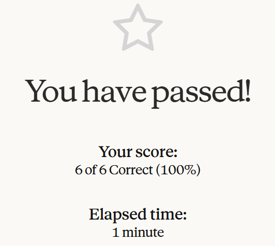

### Prompt Engineering

#### Topics Covered

- Be clear and direct
- Be specific about the task and requirements
- Structure the prompt with XML tags so that longer pieces of text can be easily distinguished
- Provide examples (one-shot, multi-shot)

#### Quiz 3

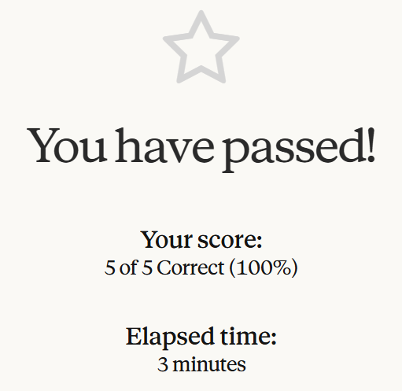

### Tool Use

#### Types of Tools

- Custom Tools: Created and managed by the user and exposed to Claude for use.
- Built-In Tools: Created and managed by Claude. These will be exposed only if the user sends a small schema allowing Claude to use them.

> Some Built-In Tools may require the user to write some code to provide support to Claude.

#### Quiz 4

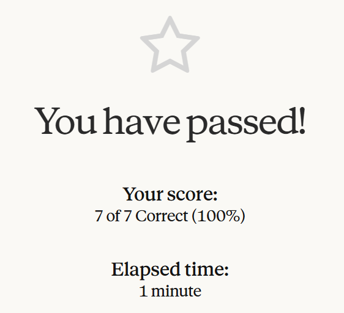

### RAG and Agentic Search

#### Chunking Strategies

- **Size Based:** Divide the text into strings of equal length.
- **Structure Based** Divide the text based upon the structure (headers, paragraphs, lists, etc.).
- **Semantic Based** Divide the text into groups based on related sentences or sections.

#### Text Embeddings

- A text embedding is a numerical representation of the meaning contained in some text.
- Anthropic does not provide an Embedding Model but recommends using VoyageAI.

#### Complete RAG Flow

- Chunk Source Text
- Generate Embeddings
- Store Embeddings in Vector Database
- Embed User Query and Find Closest Embeddings (Semantic + Lexical Searching)
- Add Related Chunks to Prompt

### Features of Claude

#### Extended Thinking

- Increased Intelligence and Cost (intelligence tokens are added to cost)
- Limit Thinking by specifying `thinking_budget` parameter.

#### Image Support

- Upto 100 images across all messages in a single request.
- Max Size 5MB.
- **Max Height/Width:**
  - **Single Image:** 8000
  - **Multi-Image:** 2000
- Image counts as tokens: (width pixels x height pixels) / 750

#### PDF Support

- This is similar to images.
- When you send a PDF to Claude, it can read images, tables and other formatting items alongside regular text.

#### Citations

- When citations are enabled, Claude can cite exact text from the document which it used for curating an answer.

#### Prompt Caching

- Cache processed user messages to avoid repeated work.
- Minimum Content Length should be 1024 to cache it.
- Best places to place a cache breakpoint is toolset and systems prompts, as there is a very less chance of it to change.

#### Code Execution and Files API

- Claude has access to a docker container with Python and can use it to execute code blocks.
- The developer can upload files to Claude beforehand so that when the user asks a query, the code actually will only send the file_id returned at the time of upload.

> The Code Execution feature does not have internet access and the docker container is an "isolated environment.

#### Quiz 5

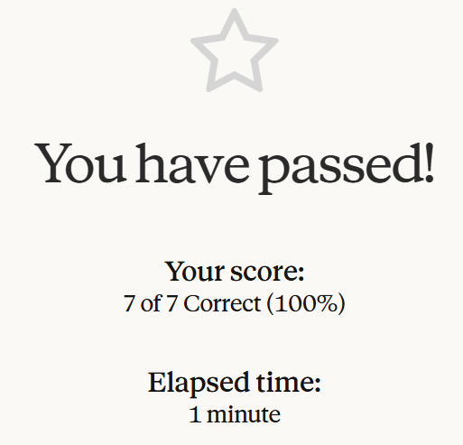

### Model Context Protocol (MCP)

- Allows the developers to shift their focus to building the application and the service providers handle the creation of the tools within the MCP.

#### Common Questions

| Question                  | Answer                                            |
| --------                  | ------                                            |
| Who Authors MCP?          | Anyone can do it but mostly the service provider. |
| MCP vs Server API?        | Author shifts from Service Provider to Developer. |
| MCP and Tool are Same?    | MCP provides tools + schemas instead of only API. |

#### Communication Flow

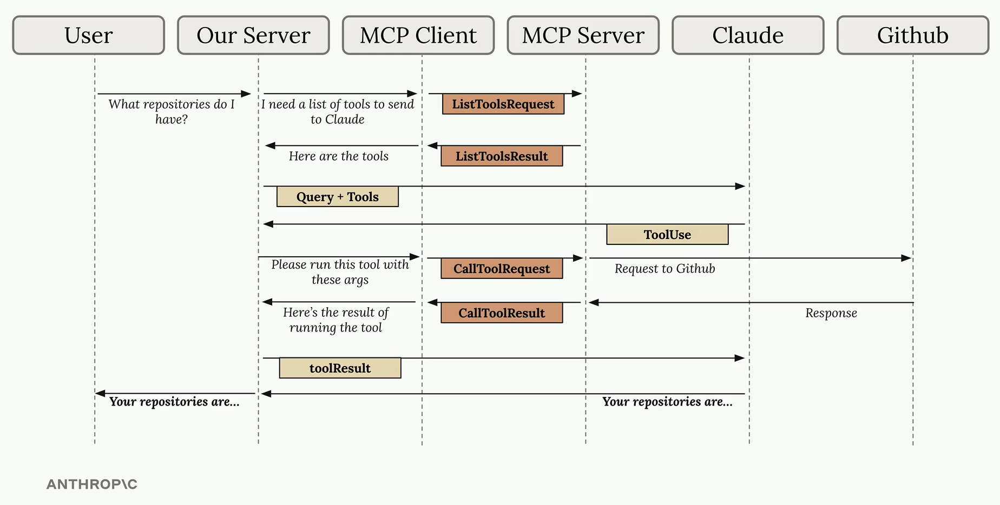

#### Python `mcp` Package - Available Decorators

- **`@mcp.tool`:** Create a tool that can be used by the clients.
- **`@mcp.resource`:** Create identifiable resources that can be used by clients.
- **`@mcp.prompt`:** Create well evaluated prompts that can be used by clients.

#### Quiz 6

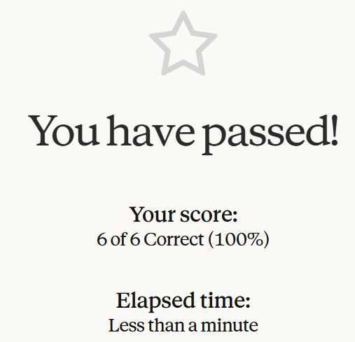

### Anthropic Apps - Claude Code and Computer Use

#### Claude Code

- Terminal based coding assistant.
- **Capabilities:** Search/Read/Edit files, Terminal Access (runs commands), Web Access, MCP Server Support.
- **Works With:** MacOS, Windows WSL and Linux.
- **Recommended Workflow:** Feed Context, Specify Task and Ask to Plan, Ask to Implement and Test.

### Agents and Workflows

#### Workflows

- **Workflow:** A series of calls to Claude meant to solve a specific problem through a predetermined series of steps. **Used** when the exact steps required to reach the goal is known.

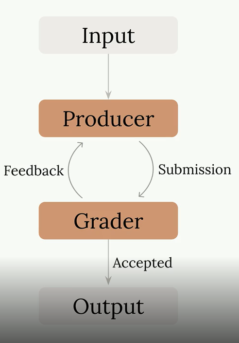

- **Parallel Workflows:** Instead of assigning one huge task to Claude, break them down into pieces and make parellel requests, then combine the responses and send it back for final analysis.

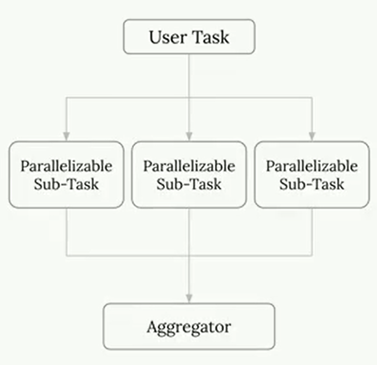

- **Chain Workflows:** If the tasks are required to be executed sequentially, then use chain workflows where the result of one claude request is sent as input in the next claude request.

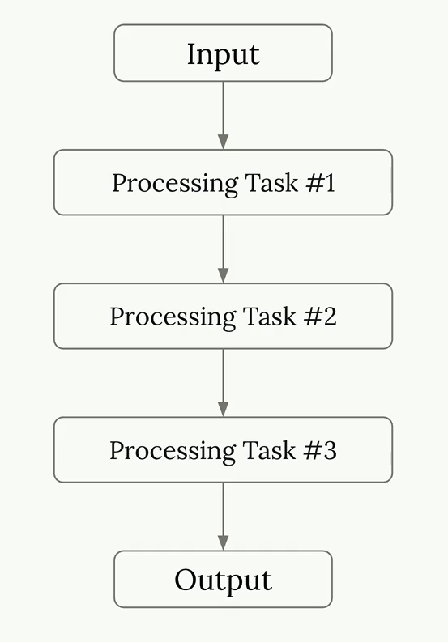

- **Route Workflows:** A workflow where paths need to be chosen based on some decision logic.

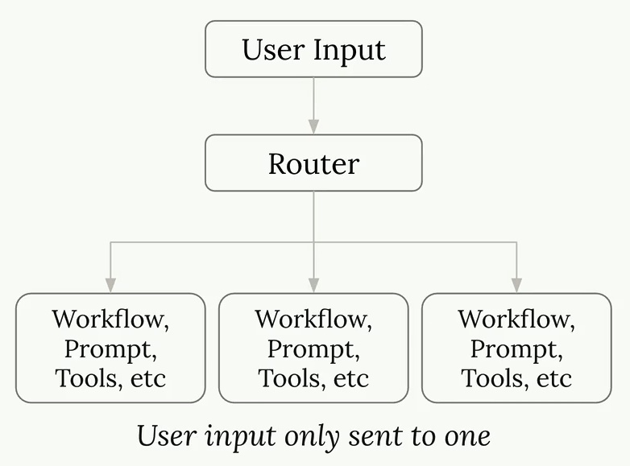

#### Agents

- **Agent:** Claude is given an goal and set of tools. Claude is expected to figure out how to complete the goal through provided tools.

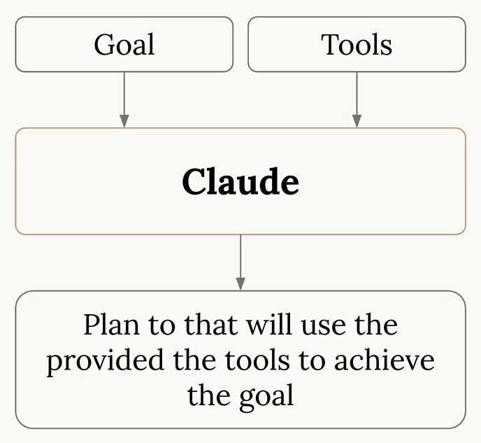

- **Best Practice:** Provide reasonably abstract tools that Claude can combine together for complex tasks.
- **Environment Inspection:** Claude operates blindly, it needs to be able to observe the environment. For example, when Claude is using **computer user** feature, it will take a screenshot after every action to understand what was the result of the action.

#### Workflows vs Agents

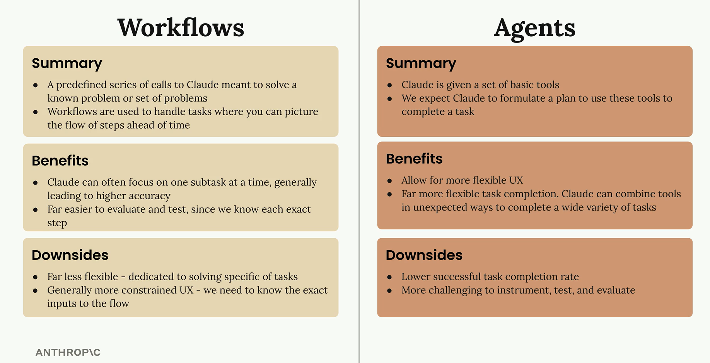

#### Quiz 7

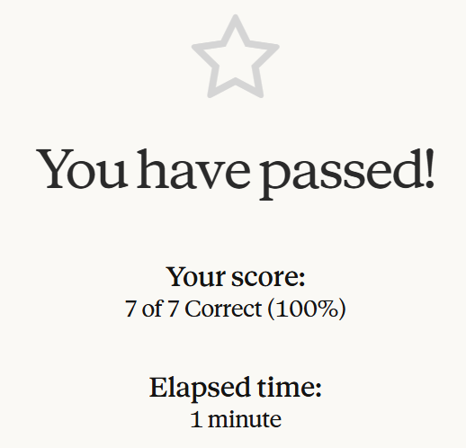

## Certificate of Completion

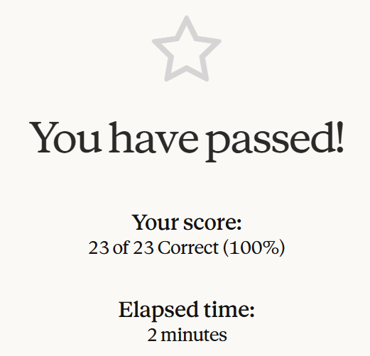

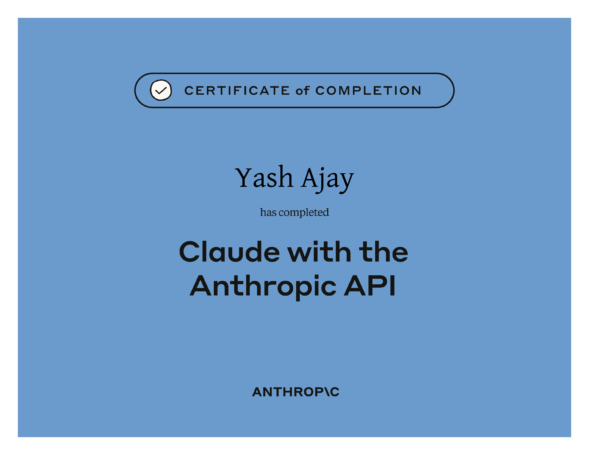
