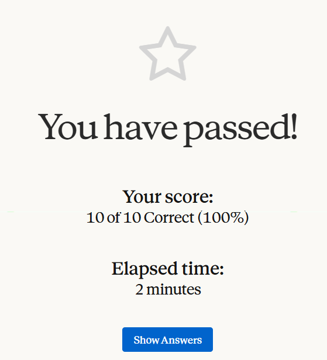

# Claude 101

## Course Notes

> URL: [Claude-101](anthropic.skilljar.com/claude-101)

### Ways to access Claude

1. Claude.ai
2. Claude Code
3. @Claude (in Slack)
4. Claude Design (Ideas -> Interfaces)
5. Claude for M365

### Writing Effective Prompts

1. **Setting the Stage:** Identifying the **persona** of the problem that AI should mimic.
2. **Defining the Task:** Laying out the **details of the task** that the AI needs to do.
3. **Specifying Rules** Specifying rules such as **word counts, response tone, response output**, etc.

### Common Challenges

| Challenge        | Reason                          | Fix                                                                      |
| ---------------- | ------------------------------- | ------------------------------------------------------------------------ |
| Generic Response | Not enough context in prompt    | Add more details on the task details + how you expect the response to be |
| Response Length  | Limit is not specifed in prompt | Specify the limit in the prompt                                          |
| Format Issues    | Does not understand your style  | Provide a sample file or detailed instructions on output format          |
| Wrong Response   | AI is not Perfect               | Verify the key aspects of the response manually                          |
| Tone Issues      | Default tone is being used      | Specify the exact tone in the prompt                                     |

### AI Fluency

1. **Delegation:** Deciding what to give to **AI** and what to do **on your own**.
2. **Description:** **Effective communication** with AI systems.
3. **Discernment:** Thoughtfully and Critically **evaluating** AI responses.
4. **Diligience:** Using AI **responsibly** and **ethically**.

#### Simple Evaluation Approach

1. **Gather Examples:** Tasks that you have **manually completed and documented** in the past.
2. **Create Test Prompts:** Test the same task using **AI with custom prompt**.
3. **Compare Outputs:** By comparing outputs, you may either **understand the need to expand the prompt** to be more specific, or identify a **clear gap in capabilities**.
4. **Refine Your Approach:** These steps can be repeated with a better prompt, but it will be advised to not delegate the task if gap is identified.

### Claude Desktop App: Chat, Cowork, Code

| Attribute        | Chat                        | Cowork                           | Code                            |
| ---------------- | --------------------------- | -------------------------------- | ------------------------------- |
| Optimized For    | Quick Answers/Brainstorming | Complex Work: Research, Analysis | Writing code, testing, building |
| Key Features     | Quick Entry, Dictation      | Work from Local Folders/Tasks    | Ask/Code/Plan Modes             |
| Tools/Extensions | Connectors, Skills, Claude  | Chat + Plugins + Computer Use    | Chat + Plugins + Hooks          |

### Projects

- Best used for single but **complex tasks where multiple chats organised correctly** will help both user as well as Claude.
- **When to Use:**
  - Reference materials you will use repeatedly.
  - Consistent requirements/instructions between chats.
  - Team collaboration.
- **Permission Levels:** View, Edit, Owner.
- **Best Practices:**
  - Start focused, then expand.
  - Keep knowledbase current/updated.
  - Write clear instructions.
  - Descriptive document names.
  - Reference documents by name.

### Artifacts

- **Standalone and Interactive Outputs** that Claude creates alongside the conversation.
- **Types:** Documents, Code Snippets, HTML Pages, SVG Images, Mermaid Diagrams, React Components.
- **Tips:**
  - Be specific about what you want.
  - Describe the end user.
  - Iterate incrementally.
  - Request artifacts when needed.

### Skills

- Folders of **Instructions, Scripts and Resources** that Claude **loads dynamically** to improve performance on specialized tasks.
- **Types:** Anthropic, Custom

### Projects vs Skills

| Attribute   | Projects                          | Skills                            |
| ----------- | --------------------------------- | --------------------------------- |
| Purpose     | Store knowledge Claude references | Define processes Claude executes  |
| Best For    | Long-term context, reference docs | Repeatable multi-step workflows   |
| Example     | Customer Hub, Feedback Generator  | Process Guidelines, Blog Drafting |
| Persistence | All chats in the project          | Applied when skill is invoked     |

### Connecting Tools

- **What are Connectors**
  - Allows Claude to use the tools/platforms that the users use for their daily work.
  - Claude can gather information from or perform actions on the tools.
  - Powered by **Model Context Protocol (MCP)**.
  - **Types:** Web Connectors, Desktop Extensions
- **Security and Permissions when Connecting a Tool**
  - Scoped Access
  - Claude sees what the user sees
  - Revocable

### Enterprise Search

> Team/Enterprise Plans

- Adds a dedicated **Ask {Your Org's Name}** option to the user's sidebar.
- Designed for finding and synthesizing knowledge buried across the user's company's tools and data sources.
- **Performable Tasks:** Getting up to speed (coming back from vacation), policy and process questions, research and analysis, onboarding new team members, performance and project tracking.

### Research Mode for Deep Dives

- Transforms Claude from a **conversational assistant to a systematic investigator**.
- Explores the questions from multiple angles and provides a comprehensive report.
- **Execution Steps:** Plan, Search, Synthesize, Cite.
- **Tips:** Be specific about goals and answer format/structure, Include relevant constraints, Refine your prompt (ask Claude).

## Certificate of Completion

