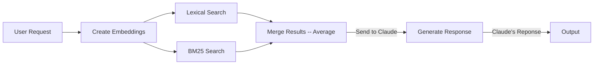
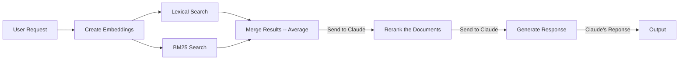
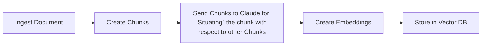
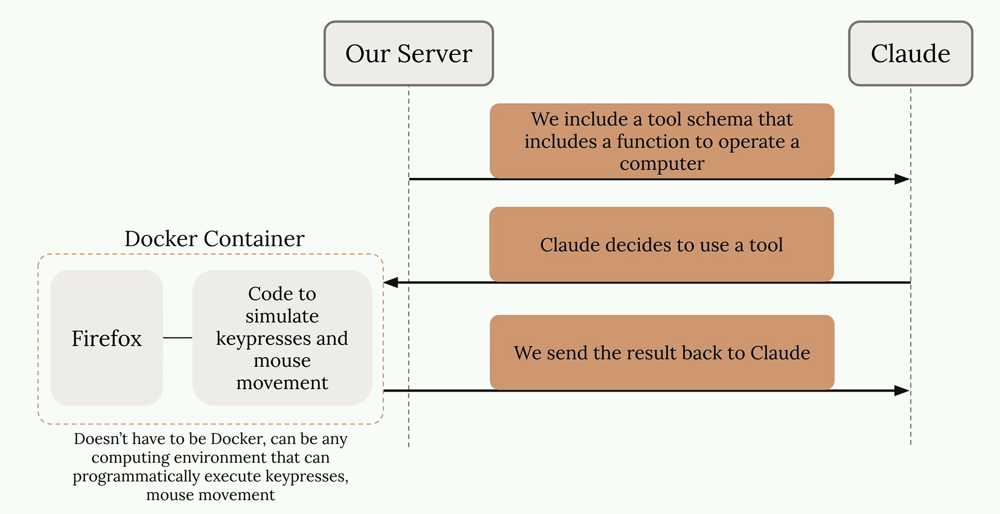
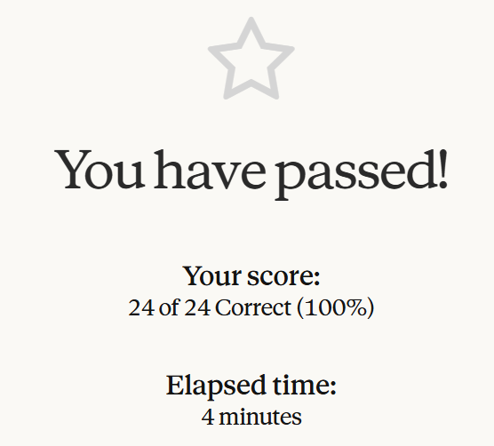
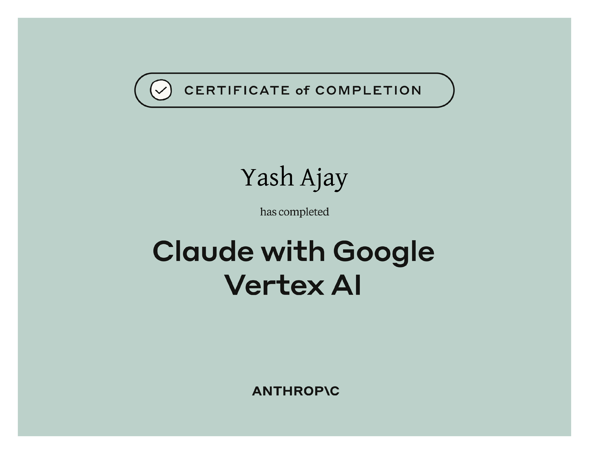

# Claude on Google Cloud

## Course Notes

> URL: [Claude-on-Google-Cloud](https://anthropic.skilljar.com/claude-with-google-vertex)
>
> Almost Identical to: [Building with Claude API](/07-building-with-claude-api.md)

### Making a Request

- Create a client using `anthropic[vertex]` package > `AnthropicVertex` with required keyword arguments `global` and `project_id`.
- `client.messages.create` remains the same as in `Building with Claude API`.

### Retrieval Augmented Generation

#### Embeddings

- When working with Claude on Vertex AI, we can use Google's text-embedding-XXX embedding models.
- To do this via python, install the `google-genai` package, create a client using genai.Client and then use client.models.embed_content to embed the text.

#### Re-Ranking

- **Current Flow:**

> Issue with this flow is that in some cases, the relevant documents may not be ranked appropriately, which may cause Claude to value less-relevant documents more than high-relevant documents.

- **Updated Flow:**

#### Contextual Retrieval

> If the number of chunks is too large to fit in one prompt, one solution is to send couple of starting chunks hoping that they provide an abstract/summary of the document + some chunks around the target chunk. This will help keep most of the context in prompt for Claude to successfully situate the target chunk.

### Anthropic Apps

#### Claude Code

- **Parallelizing Workflows**
  - Since Claude Code is a lightweight process, a user can easily run multiple instances of Claude Code that do different tasks.
  - This parallelization may lead to race conditions when 2 or more instances want to edit the same file without knowing another instance is running at the same time.
  - To solve this proble, the user can make use of a `Git Worktree` where each Claude Code instance will work on their own worktree then merge the changes to the main codebase.
  - **Most Efficient Approach:**
    - Create 2 Custom Commands title "create_worktree" and "merge_worktree".
    - Use "create_worktree" to create `n` number of worktrees based on the number of tasks to be done in parallel.
    - For each worktree, run Claude Code and give it the task to perform. Wait till all of them are complete.
    - Then use "merge_worktree" to merge the worktrees one-by-one. Claude will also help in resolving merge conflicts.

#### Computer Use

- Allows Claude to access **desktop apps**.

## Certificate of Completion

