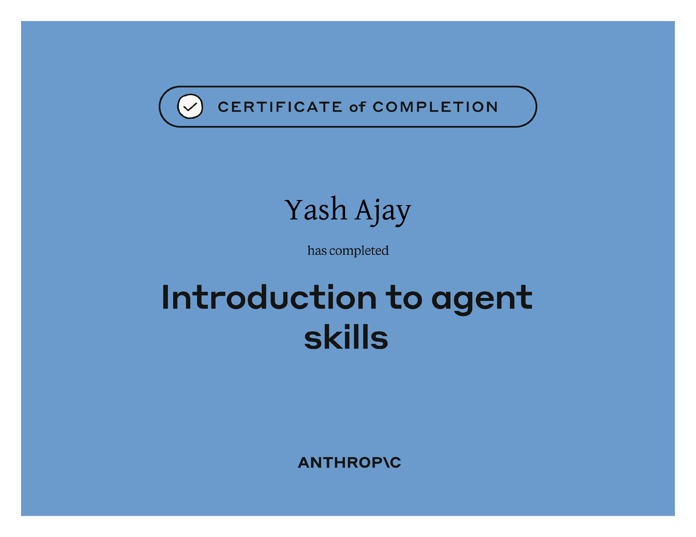

# Introduciton to Agent Skills

## Course Notes

> URL: [Introduction-to-Agent-Skills](https://anthropic.skilljar.com/introduction-to-agent-skills)

### What are Skills?s

- Folders of **Instructions, Scripts and Resources** that Claude **loads dynamically** to improve performance on specialized tasks.

### Anatomy of a Skill File

- A skill file is **essentially a Markdown file** with special formatting.
- The **metadata (name and description)** are placed at the top **between frontmatter dashes (---)**
- The **instructions and other content** is placed after the metadata section.
- The **most efficient** way of creating a skill is to give claude the details and ask it to create the skill for you.

### Multi-File Skills

- **allowed-tools** can be added in metadata to restrict Claude to specific tools when the skill is active.
- **model** can be added in metadata to specify the model that should be used for executing this skill.

### Open Standard for Organizing Skill Directory

- **scripts/:** Executable Code
- **references/:** Additional Instructions
- **assets/:** Images, templates, or other data files
- In Skill.md, link supporting files with clear instructions about when to load them. Link using simple markdown format: [Title](/relative/path/to/file)

### Comparing Skills to Other Claude Features

#### CLAUDE.md

| CLAUDE.md                                    | Skills                                       |
| ---------                                    | ------                                       |
| Project-wide, Always applies                 | Task-specific, Invoked when needed           |
| Constraints and Preferences are stored here  | Procedural Guidance and Instructions         |

#### Subagents

| Subagents                                    | Skills                                       |
| ---------                                    | ------                                       |
| Run in a separate context                    | Invoked in current/same conversation         |
| Invoked for delegating a small task          | Invoked for additional instructions          |
| Isolated from main conversation              | Part of main conversation                    |

#### Hooks

| Hooks                                        | Skills                                       |
| ---------                                    | ------                                       |
| Deterministic steps which fire on events     | Non-Deterministic which fire upon request    |

### Sharing Skills

- Project skills in `./claude/skills` are shared via version control (git).
- Plugins let you distribute skills across repositories via marketplace.
- Enterprise-managed skills are distributed organization-wide.
- Subagents don't see skills unless explicitly specified.
- Built-in Agents (Explorer, Plan, Verify) cannot see skills.

### Troubleshooting Skills

- **Skill Validator Tool:** Catches structural problems.
- **Skill does not Trigger:** Modify the description for more specificality.
- **Skill does not Load:** Check the location of `SKILL.md`, it should be inside `./claude/skills/<skill-name>/`
- **Runtime Errors:** Check dependencies, file permissions, path separators.

## Certificate of Completion

