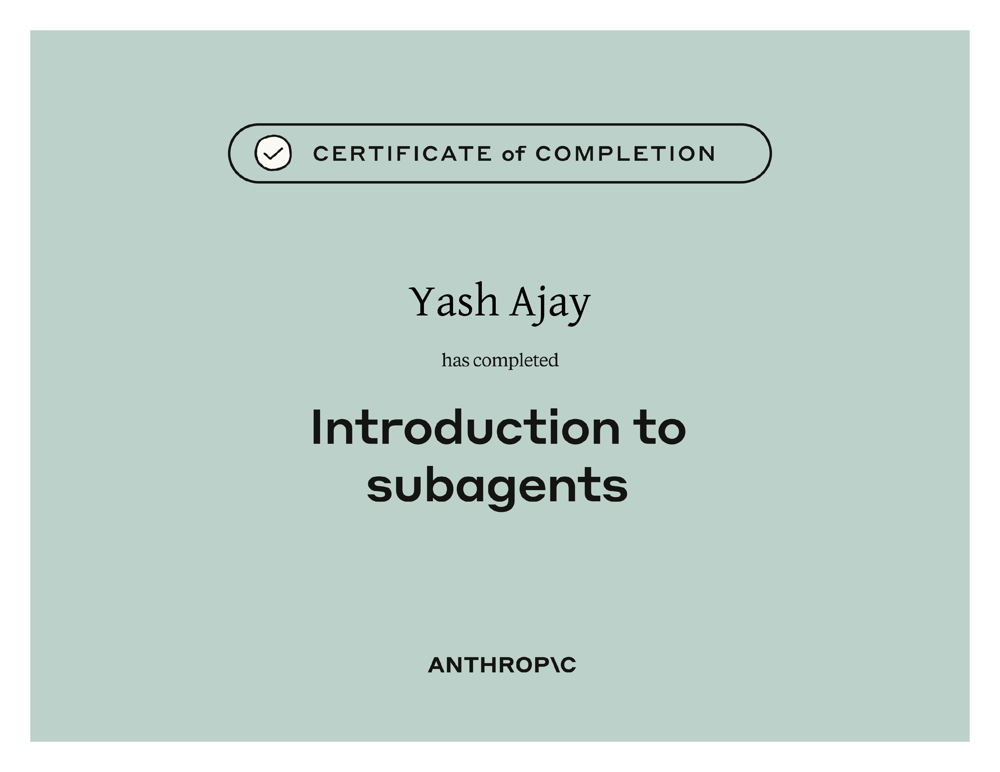

# Introduction to Subagents

## Course Notes

> URL: [Introduction-to-Subagents](https://anthropic.skilljar.com/introduction-to-subagents)

### What are Subagents?

- Subagents are **specialized assistants** that Claude Code can **delegate tasks** to.
- Subagents not-only offload tasks from the main conversation, but also help in context management. Subagents run with their own context and only add a summary of it to the main conversation when their job is completed.
- **Built-in Subagents:** General Purpose, Explorer, Plan.
- **Custom Subagents:** Users can create their own subagents with custom system prompts and tool access.

### Creating a Subagent

- The **most efficient** way of creating a subagent is to give claude the details and ask it to create the skill for you.
  - Choose between `project-level` and `user-level`
  - Choose between `manual configurations` and `generate with claude`
  - Choose between `all tools`, `read-only tools`, `edit tools`, `execution tools`, `mcp tools` and `other tools`.
  - Choose model
  - Choose color (helps in uniquely identifying which subagent is being used for a task)
  - Config file is created in `./claude/agents/<agen-name>.md`. This file has the same structure as the Skills file.

### Best Practices

- Precise Descriptions
- Defining an Output Format
- Reporting Obstacles
- Limiting Tool Access

## Certificate of Completion

