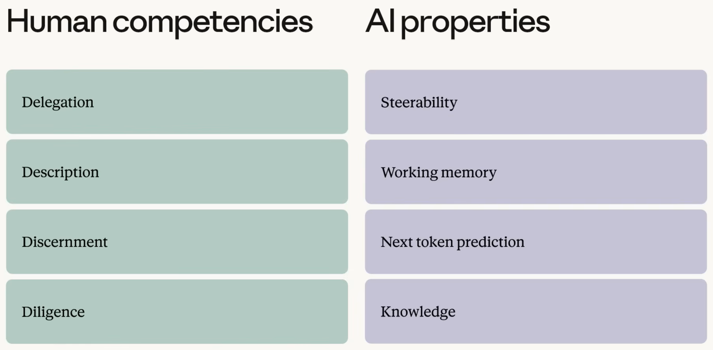
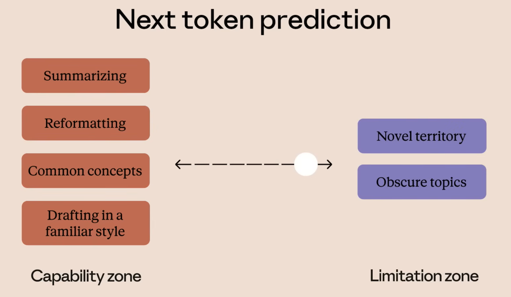
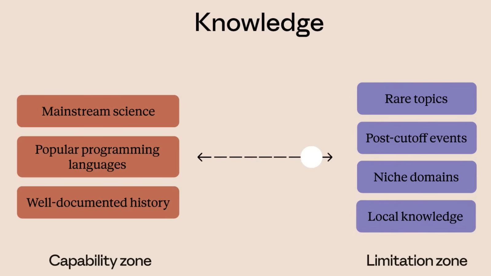
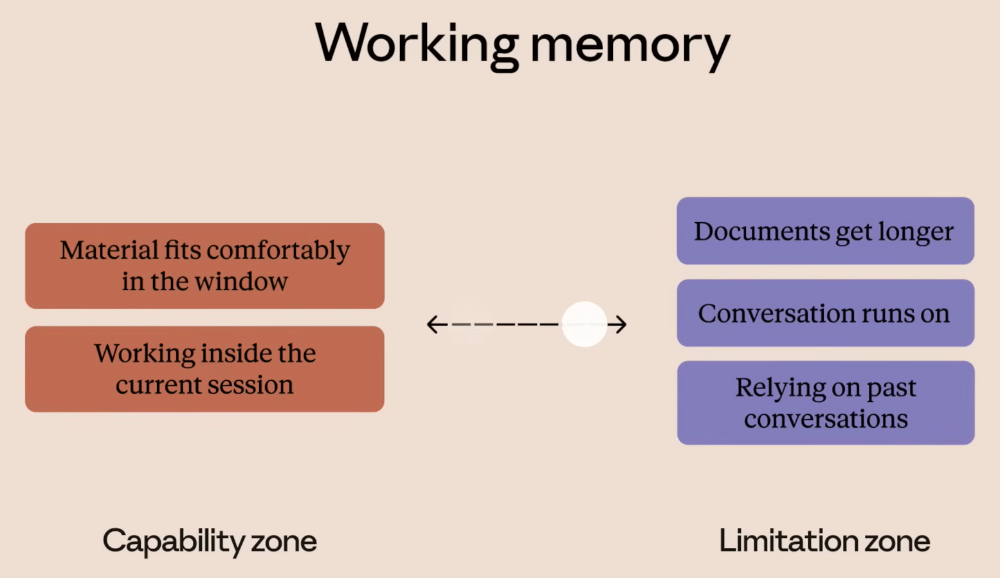
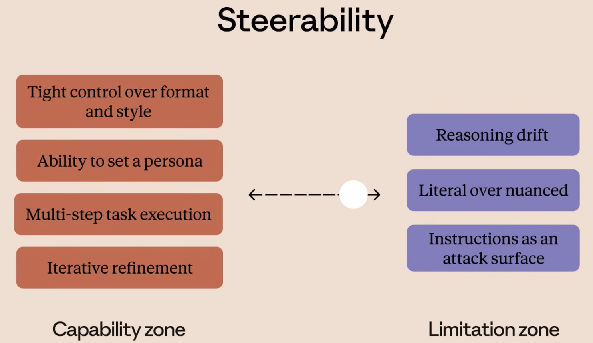
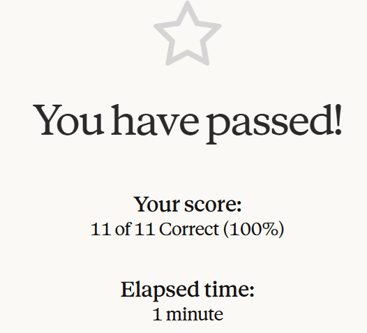
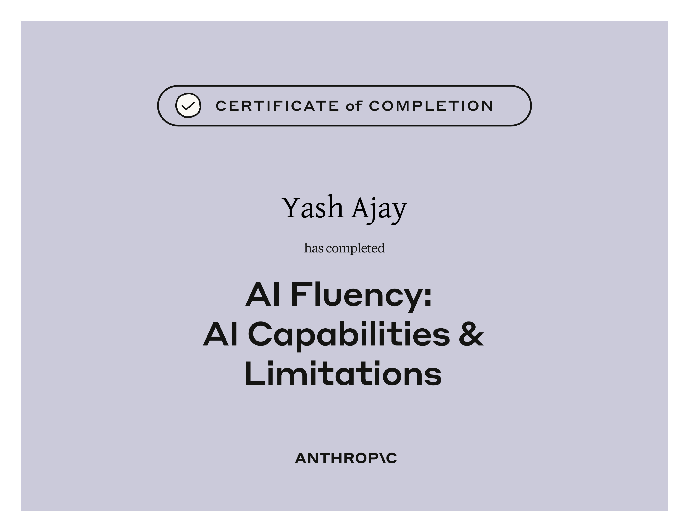

# AI Capabilities and Limitations

## Course Notes

> URL: [AI-Capabilities-and-Limitations](https://anthropic.skilljar.com/ai-capabilities-and-limitations)

### Model Building Steps

- **Pretraining:** Provide an example and let AI decide what comes next, repeat billions and trillions of times.
- **Fine-Tuning:** Make AI safe and ethical.

### AI Companion of Human's 4D Framework

#### Next Token Prediction

- **What this Enables:** Fluent in any register, Rapid synthesis, Strong pattern recognition, Coherent continuation
- **Where this Fails:** Hallucination, Inconsistency, Misplaced Confidence
- **Features that Help:** Citations and source grounding, Trained uncertainty signaling, Constrained generation and skill, Generator-verifier agent loop

#### Knowledge Gaps

- **Knowledge Cutoff:** Claude's knowledge will be limited to this cutoff date unless it is given a tool to browse the internet.
- **Limitations:** Staleness, Uneven Coverage, Inherited Bias, Source Amnesia, Time-Sensitive and Rare Topics
- **Features that Help:** Web Search, MCP, Tool Use, Explicit Cutoff Disclosure

#### Context Window

- **What it Contains:** Prompts, AI Responses, Any other shared info
- **Features that Help:** Memory, Compaction (Summarization), Projects and Workspaces, Skills, Multi-Agent Workflows, Larger Context Windows
- **Practical Tips:** Put most important material near the top, Chunk long work into passes, Use features to save your context, Start fresh with summary of previous chat

#### Steerability

- **Ways to Steer AI Output:** Specify Role, Tone, Format, Word Limit, Set of Rules
- **Features that Help:** System Prompts, Visible Reasoning, Structured Output Modes

## Certificate of Completion

