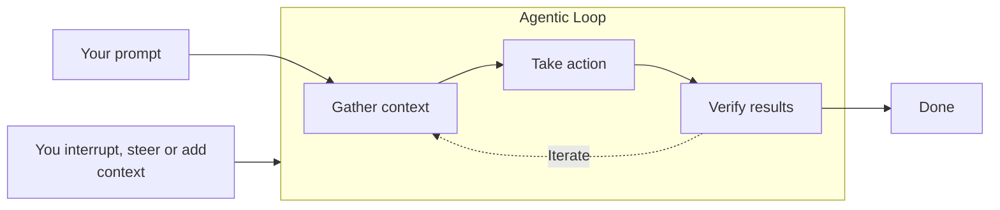
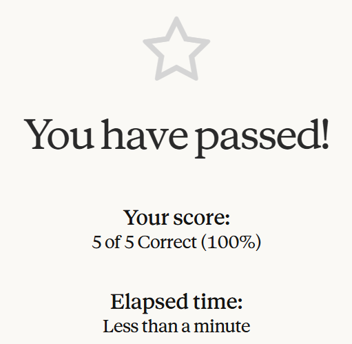
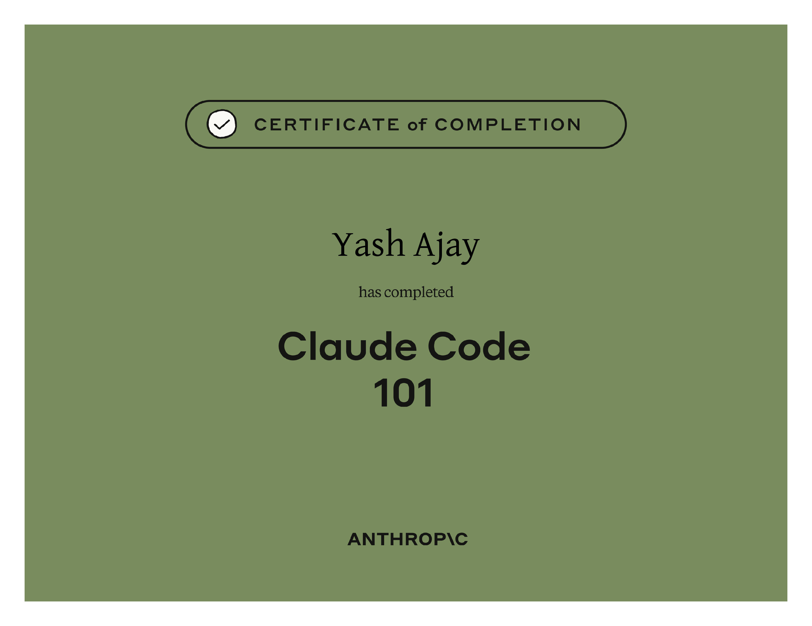

# Claude Code 101

## Course Notes

> URL: [Claude-Code-101](https://anthropic.skilljar.com/claude-code-101)

### What is Claude Code?

- Agentic coding tool that understands the codebase, edits your files, runs commands, and integrates with your existing developer tools to help you get things done faster.

### Claude AI vs Claude Code

- Claude AI is a conversational chatbot, whereas Claude Code is essentially an "AI Agent" that can run tasks/operations on loop to accomplish an end goal.
- **Agent:** A software that can interact with its environment and perform actions to complete a defined goal.
- **Claude Code Capabilities:** Read and understand your codebase, edit files across your project, run terminal commands, search the web.
- **Effective Use of Claude Code:** Context Window, Permission Requests, Mistakes.

### How does Claude Code Work

### Where can Claude Code be Installed?

- Terminal
- IDEs such as VSCode and JetBrains
- Desktop App
- [Web](claude.ai/code)

### Claude Code: Modes

- **Auto-Accept:** Claude asks permissions before editing files or running commands.
- **Approval:** Claude edits files without permission but asks before running commands.
- **Plan:** Read-only mode that creates only the plan of action which can be edited and implemented incrementally.

### The Workflow

- **Explore:** Let Claude read and understand the codebase, the task and do some research on best practices/implementations.
- **Plan:** Once the research is done, let Claude create a Plan Document that can be reviewed and edited to perfection iteratively. (Use Plan Mode).
- **Code:** Once the plan is finalized, ask Claude to implement the task.
- **Commit:** After thorough manual testing, commit and push the solution for versioning.

### Context Management

- **Compact**
  - Summarizes the context that is still needed and discards what is not.
  - Runs automatically if the context window is full.
  - Run manually using `/compact` command.
  - Use when working on same task but context window is full.
- **Clear**
  - Clear all context.
  - Run manually using `/clear` command.
  - Use when starting a new task and don't want previous context to add bias.

> Use `CLAUDE.md` to store global instructions.

### Code Review

- **Review with Subagent:** Before pushing a PR, ask Claude to run subagent to review your changes. Subagent runs with its separate context window and acts as **fresh eyes** without any bias of knowledge.
- **/commit-push-pr Skill:** Handles the Commit, Push and PR creation all in one step. Automatically posts PR link to Slack channel if connected.
- **Session Linking with --from-pr:** Claude links chat sessions with PRs, run `claude --from-pr <PR_NUMBER>` to continue in the original session to address fixes or review comments.

### The CLAUDE.md File

- **Persistent Memory** of the project.
- Use this file to add global instructions that should be respected irrespective of the chat session.
- **Access Levels**
  - **Project Level:** Shared with the team, contains project-specific instructions (where to store files, what components to use, etc.)
  - **User Level:** Lives in personal configuration folder, contains user-specific instructions (how to write comments, etc.)
- **Tip:** Start without a CLAUDE.md file to first analyze which instructions need to go in it. Helps keeping the file compact.

### Subagents

- Claude can **delegate tasks to subagents** that break them down and **run component tasks in parallel**, improving your context management.
- Has its own context window and only provides the summary of it to the main agent for reference.
- Create your own subagent using Markdown files with YAML frontmatter. Claude can generate it using `/agents` command.
- **Customization**
  - **Persistent Memory:** Lets your agent maintain memory across conversations.
  - **Preload Skills:** Add `SKILL` key and list skills by name.

### Skills

- **Repeatable tasks can be automated** using skills.
- A CLAUDE.md file is **always loaded completely** in context, but for skills, only the **name and description are loaded initially**. Claude will load the rest of the details if it feels that it needs to use the skill for that particular request.

### Model Context Protocol (MCP)

- MCP is an open standard that lets **Claude Code connect to external tools and data sources**.
- Each MCP connection loads all tool names and their descriptions/how-to-use in Context. **Large number of MCPs can eat a lot of Context**. To tackle this situation, Claude will switch to **tool search** mode when MCPs take up around 10% of the Context, but this may not work well.
- It is better to use an MCP **only** when a CLI alternative is not available, for example, using GitHub MCP instead of the `gh` CLI commands will be a waste of Context space.
- **Adding MCP Server:** claude mcp add --transport <http/stdio> <url/python-code-local-path>
- **Scoping Servers:** Local (personal to user but limited to 1 project), User (personal to user but across projects), Project (available for team members).

### Hooks

- Hooks let you **run commands at specific points** in Claude Code's lifecycle.
- Hooks are **deterministic** - they always run.
- **Common Use Cases:** Auto-formatting after file edits, Blocking dangerous file operations.
- They are configued in `.claude/hooks/settings.json`.
- **Available Events:** PreToolUse, PostToolUse, UserPromptSubmit, Stop, Notification.

## Certificate of Completion

