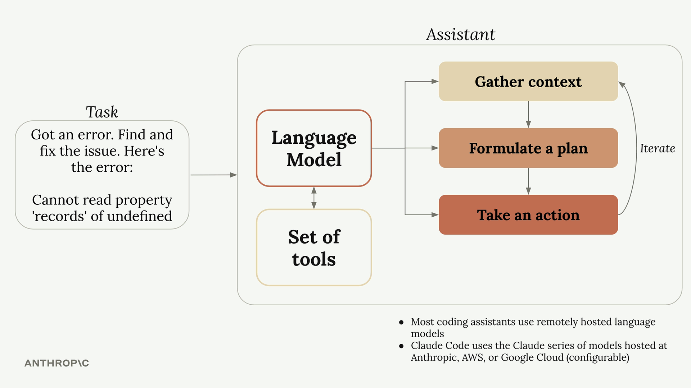
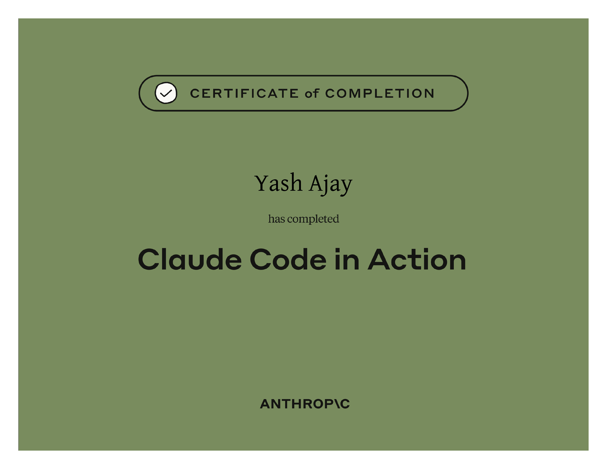

# Claude Code in Action

## Course Notes

> URL: [Claude-Code-in-Action](https://anthropic.skilljar.com/claude-code-in-action)
>
> This course is more practical than theoretical, I recommend watching the course.

### What is a Coding Assistant?

- They use language models internally to complete different tasks.
- Language models need to use tools to work a vast majority of tasks.
- Not all language models use tools with the same finesse.
- Claude's strong tool use with Claude Code allows for better security, customization and longevity.

### How Coding Assistant's Work

### CLAUDE.md File

- **Levels:** Project, User, Local (or Machine)
- Add custom instructions by entering `/memory` in the Claude Code chat window.
- Reference files using `@FilePath` in Cladue Code chat window as well as CLAUDE.md file.

### Planning vs Effort (Thinking)

- **Planning Mode is Best For -- Knowledge Breadth**
  - Tasks requiring broad understanding of the codebase.
  - Multi-step implementations.
  - Changes that affect multiple files and components.
- **Adjusting to a Higher Effort Level is Best For -- Reasoning Depth**
  - Complex logic problems.
  - Debugging difficult issues.
  - Algorithmic challenges.

### Creating Custom Commands

- Create a new folder inside /.claude and name it `commands`.
- Create MD files inside the commands folder and they will be identified as commands.
- Use `$ARGUMENTS` to add custom arguments that are taken from the user's prompt at runtime.

### Adding/Installing MCP Servers

- Command: `claude mcp add <mcp_name> <mcp_command_to_run>`
- Optionally, Add it to **Allow** or **Deny** list in the `/.claude/settings.local.json` in the "mcp__<mcp_name>" pattern.

### GitHub Integration

- **Setup Walkthrough:** `/install-github-app`
- **Default GitHub Actions:** Mention, Pull Request
- **Customizing Workflows:** in the `/.github/workflows/` folder, you can find the actions YAML scripts, refer to the documentation and add the features you would like Claude to have.
  - **Important Caveat:** When using MCPs in GitHub Actions, all tools provided by the MCP need to be listed explicitly in the **allowed_tools** section.

### Hooks

- Used for Deterministic behavior that Claude AI cannot be trusted on to follow religiously.
- **Example:** Format a file after Claude makes file changes.
- **Events:** Notification, Stop, SubagentStop, PreCompact, UserPromptSubmit, SessionStart, SessionEnd.

### Claude Code SDK

- Claude Code is available to use programmatically.
- **Availability:** TypeScript, Python, CLI.

## Certificate of Completion

