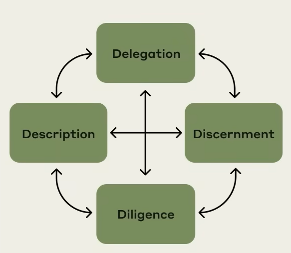
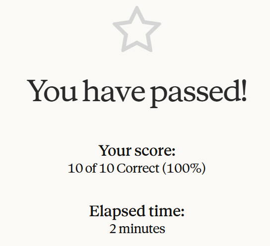
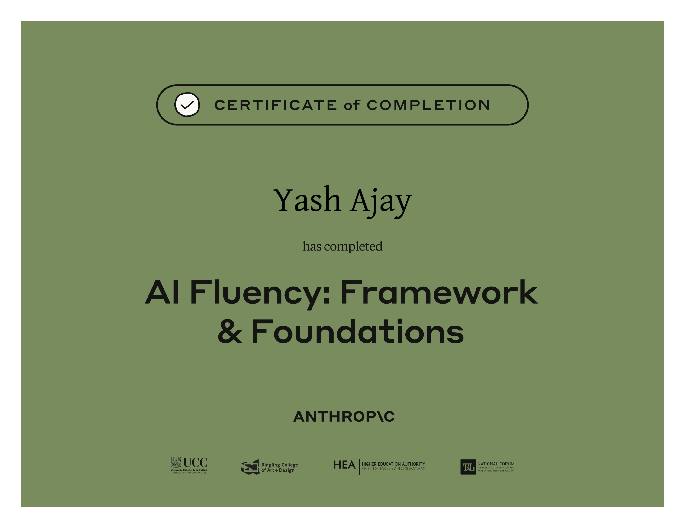

# AI Fluency: Framework & Foundations

## Course Notes

> URL: [AI-Fluency-Framework-Foundations](https://anthropic.skilljar.com/ai-fluency-framework-foundations)

### Why Do We Need AI Fluency

- **Ways in which People Engage with AI:** Automation (AI completes the task), Augmentation (Collaboration), Agency (Using AI as an Employee and monitoring behavior and knowledge).

### 4D Framework

- **Delegation Components:** Problem Awareness, Platform Awareness, Task Delegation.
- **Description Components:** Product, Process and Performance Descriptions.
- **Discernment Components:** Product, Process and Performance Discernments.
  - Description and Discernment work in a Loop till the desired results are achieved.
- **Diligience Components:** Creation, Transparency, Deployment Diligience.

## Certification of Completion

