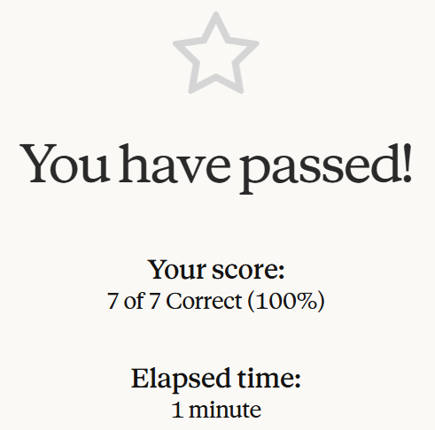
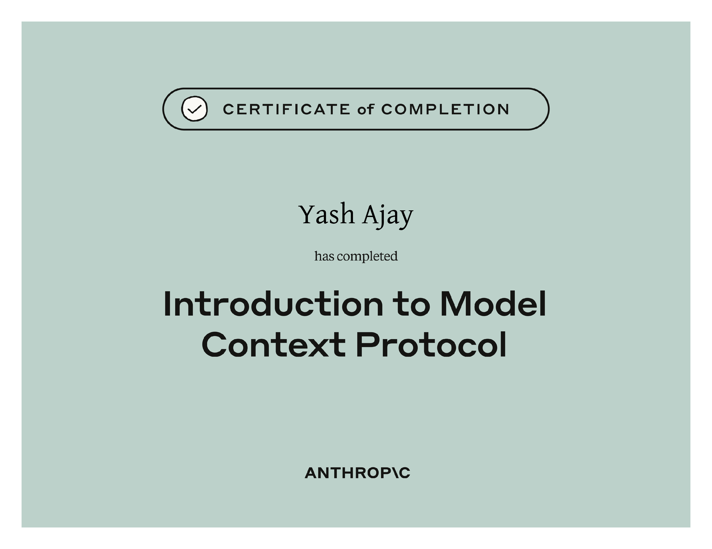

# Introduction to Model Context Protocol

## Course Notes

> URL: [Introduction-to-Model-Context-Protocol](https://anthropic.skilljar.com/introduction-to-model-context-protocol)
>
> Repeat of [Building-with-Claude-API--MCP](/7-building-with-claude-api.md#model-context-protocol-mcp)

## Certificate of Completion

